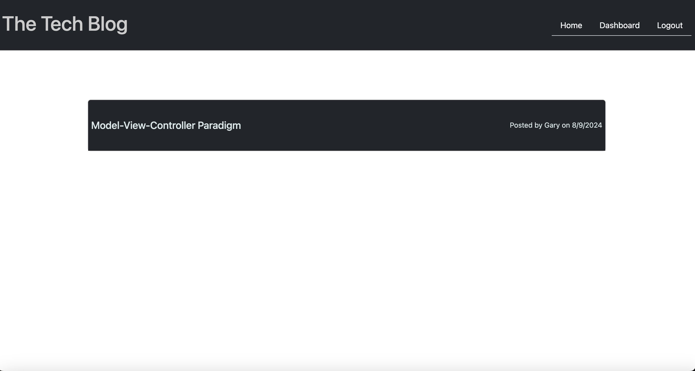

# Tech Blog Application using the Model-View-Controller

## Table of Contents
-[Description](#description)
 
-[Installation](#installation)
 
-[Usage](#usage)
 
-[Contributing](#contributing)
 
-[License](#license)
 
-[Tests](#tests)
 
-[Questions](#questions)
 

## Description

This application is a blog page where developers can share views and thoughts with other registered users of the app.  It gives the option to create an account so that a user has the ability to add, update, delete  their post.  In addition each user can comment on other developers post.  The purpose behind this project was to build a full stack application using the Model-View-Controller (MVC) paradigm.  The application uses Handlebars.js for templating to render the page to the user (View). Sequelize helps the organize the database interactions and managing the relationships between models.  A new technology that was used in this project was express-session which is a tool that helps manages the users session. It primarily handles the requests related to user login, logout, and session management which is associated with cookies.  Using the MVC concept creates an intuitive way to write simpler code connecting both the back and front end seamlessly.

## Installation

To install this project you can either clone the repo or download all the files.  To run this application one must have Node already installed on their computer to download all the npm packages.  Once all the files are ready open the files in a code editor, open the terminal and enter the command ‘npm i” which will install all the dependencies for the application.  In order to continue forward you must have an account with PostgresSQL to work with the database.  Run the schema file in the db folder to create the database that will be used for this project.  After this create a .env file and place all your Postgres credentials so that Sequelize has access to a database, as well as the secret for the cookie.  

## Usage

In order to run the application run, start the server with the command “node server.js” or “npm run start”.  After that head to whatever port that the application is running on and it can be viewed on the frontend.  To create an account head to the Login page and click on the create user link.  Once there create an account and then it will redirect to that users dashboard page will give the option to add a post.  User has the option to update or delete a post that they have made by clicking on a specific post on the dashboard page.  In addition user can comment on other posts by heading to the home page and clicking on that post.

### Deployed App
https://mvc-tech-blog-app.onrender.com/

### Screenshot

## Contributing

N/A
## License

This repository is covered under the MIT license

## Tests

N/A

## Questions

* GitHub Profile: [EzekielCampos](https://github.com/EzekielCampos)

If you have any additional questions contact me by email at ezcampos603@gmail.com

